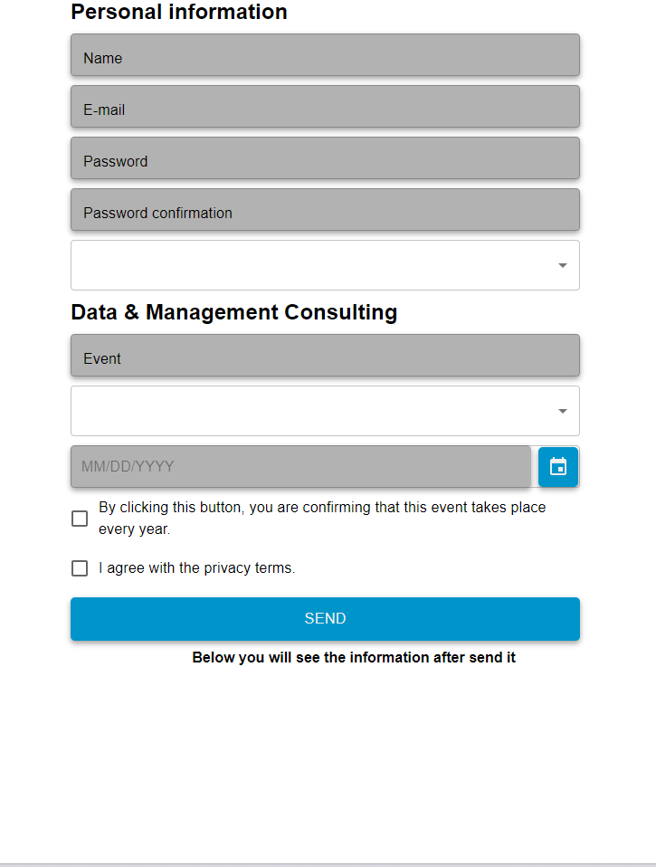
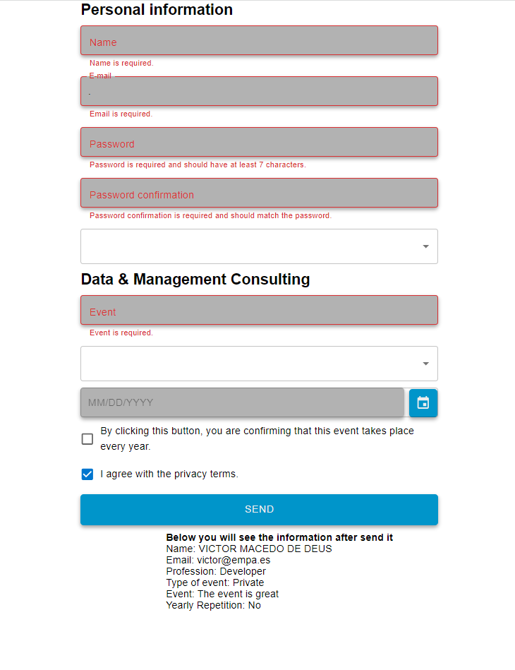

 <h1 align="center"> 🎯 React Material-UI Form with react-hook-form 🎯</h1>
  <h3 align="center">  React | TypeScript | Material UI | react-hook-form library. </h3>


 <p align="center">
   Form.
    <br />
    <a href="https://github.com/victorcodigos/form-empa"><strong>Explore the docs »</strong></a>
    <br />
    ·
    <a href="https://github.com/victorcodigos/form-empa/issues">Report Bug</a>
    ·
    <a href="https://github.com/victorcodigos/form-empa/issues">Request Feature</a>
  </p>

This is an example of a React form using Material-UI and the `react-hook-form` library. The form collects personal information, details about an event, and privacy terms. It also includes a date picker and an option to indicate whether the event occurs annually.

<h1>
   </img>
  
  </h1> 

 <h1 align="center"> Contents </h1>

- [Installation](#installation)
- [Usage](#usage)
- [Code Details](#code-details)
- [Styles](#styles)


  <h1 align="center"> Clone it </h1>

  <h4 align="center"> To run this project on your local environment, follow these steps:</h4>


1. Clone the repository:

   ```bash
   git clone https://github.com/victorcodigos/form-empa

    ```
   

 <h1 align="center"> Form Component with React and Material-UI </h1>

This is a brief overview of a form component in a React application that uses Material-UI components. Below, you'll find explanations for the code segments used.
<h1 align="center">  Importing Libraries and Components </h1>


The code starts with importing essential libraries and components to create a user-friendly form:

```TypeScript
import { SubmitHandler, useForm } from "react-hook-form";
import { useState } from "react";
import isEmail from "validator/lib/isEmail";
import TextField from "@mui/material/TextField";
import Button from "@mui/material/Button";
import { Checkbox, FormControlLabel, MenuItem, Select } from "@mui/material";
import { AdapterDayjs } from "@mui/x-date-pickers/AdapterDayjs";
import { LocalizationProvider } from "@mui/x-date-pickers/LocalizationProvider";
import { DatePicker } from "@mui/x-date-pickers/DatePicker";

```

The code segment begins by importing various libraries and Material-UI components used for creating a form.

- **SubmitHandler and useForm**: Imported from the "react-hook-form" library, they are essential for handling form submissions and form state management.

- **useState**: Imported from "react," it is used to manage component-level state within the form.

- **isEmail**: A function imported from the "validator" library, it checks if an input value is a valid email address.

- **Material-UI components**: These include `TextField`, `Button`, `Checkbox`, `FormControlLabel`, `MenuItem`, `Select`, `AdapterDayjs`, `LocalizationProvider`, and `DatePicker`. They are imported to build a user-friendly form with Material-UI styling.


```
```
<h1 align="center">  Some Inputs: </h1>

### Input Field: "Name"

This code represents a text input field used within a form:

- **TextField**: This is a Material-UI component that creates a text input field.

- **fullWidth**: This property ensures that the input field spans the entire available width.

- **label**: It specifies the label text for the input field, in this case, "Name."

- **variant**: The "outlined" variant provides the input field with a border and distinctive styling.

- **error**: This is a conditional property, and it is used to determine whether there are any errors associated with this field. The double negation (`!!`) checks for errors and triggers an error state if they exist.

- **helperText**: This property is responsible for displaying an error message when there are validation errors for the "Name" input. If there are no errors, this field remains empty.

- **...register("name", { required: true })**: This line registers the "Name" input with the `react-hook-form` library and specifies that it is a required field. This registration connects the input to form validation and state management.


```

```

### Input Field "Confirmation password"

The "Password Confirmation" input field is designed for users to re-enter their password to confirm it. Here's a breakdown of its features:

- **TextField**: This input field is created using the Material-UI component.

- **fullWidth**: The `fullWidth` property ensures that the input field spans the entire available width, making it user-friendly.

- **type="password"**: The input type is set to "password," which means that the entered characters are hidden for security when confirming the password.

- **label="Password confirmation"**: The label "Password confirmation" informs users about the purpose of this input, which is to confirm the password they previously entered.

- **variant="outlined"**: The "outlined" variant provides the input field with a border and distinctive styling, improving the user interface.

- **error={!!errors.passwordConfirmation}**: This condition checks if there are any errors associated with this field. If validation errors are present, it triggers an error state, providing immediate feedback to users.

- **helperText**: The `helperText` property displays an error message when there are validation errors for the password confirmation. When no errors are present, it remains empty, creating a clean user experience.

- **{...register("passwordConfirmation", { required: true, validate: (value) => value === watchPassword })}**: This line connects the "Password confirmation" input to the `react-hook-form` library. It specifies that this field is required and should match the password entered earlier. This ensures that users accurately confirm their password.

```

```
<h1 align="center">  Validation and also it shows all infos bellow: </h1>
<h1>
   </img>
  
  </h1> 

### Input Field "Type of event"

The "Type of Event" selection input field allows users to specify the category or type of event they are organizing. Here's a detailed explanation of this input field:

- **Select**: This input field is created using the Material-UI `Select` component.

- **fullWidth**: The `fullWidth` property ensures that the input field spans the entire available width, providing a user-friendly interface.

- **label="Type of event"**: The label "Type of event" provides clarity to users, indicating the purpose of this input field.

- **variant="outlined"**: The "outlined" variant gives the input field a border and a distinct style, improving the overall user experience.

- **error={!!errors.typeofevent}**: This condition checks for validation errors associated with the "Type of Event" input. If any errors are detected, it triggers an error state, giving immediate feedback to the user.

- **value={typeOfEvent}**: The `value` property holds the currently selected type of event, which is managed by the component's state.

- **onChange**: The `onChange` event handler allows users to select a type of event from the dropdown list. When a selection is made, it updates the `typeOfEvent` state.

- **Menu Items**: The dropdown menu consists of several options representing different types of events, including "Select your type of event...," "Private," "Company," "Voluntary," "Partner," and "Other."

- **{errors.typeofevent && (...)}**: This part of the code displays an error message if the "Type of Event" input fails validation. The error message informs users that selecting a type of event is required.

```

```
### Input Field "Yearly Repetition Checkbox"

The "Yearly Repetition" checkbox is used to confirm whether the event recurs annually. Here's a detailed explanation of this input field:

- **FormControlLabel**: This component is used to create a label for the checkbox, making it user-friendly and providing additional context.

- **Checkbox**: The "Checkbox" component allows users to toggle a binary choice. In this case, it's used to confirm yearly event repetition.

- **{...register("yearlyRepetition")}**: This line registers the "Yearly Repetition" checkbox with the react-hook-form library, making it part of the form's data. The name "yearlyRepetition" is assigned to this field.

- **name="yearlyRepetition"**: The name assigned to the checkbox is "yearlyRepetition," which is used to identify the field when handling form data.

- **color="primary"**: The "color" property defines the primary color scheme for the checkbox, aligning it with the overall theme.

- **label**: The label text provides a clear description of the checkbox's purpose, indicating that clicking it confirms the event's annual recurrence.

This "Yearly Repetition" checkbox is used to capture whether the event takes place every year, providing a straightforward way for users to indicate this information in your form.

```
```

### Submitted Data Display

The "Submitted Data" section is responsible for displaying user-submitted information after a form is submitted. Here's a detailed explanation of this section:

- **h4**: This HTML element is used to create a subheading with the text "Below you will see the information after sending it." It provides context to users, letting them know what to expect.

- **{submittedData && ...}: This conditional statement checks whether there is any submitted data to display. If there is, it proceeds to render the data.

- **p**: The HTML "p" (paragraph) element is used to display individual pieces of submitted data.

- **Name, Email, Profession, Type of Event, Event**: These labels are followed by corresponding placeholders (e.g., {submittedData.name}) which are dynamically populated with the user's submitted data.

- **Yearly Repetition**: For this field, a ternary operator is used to display "Yes" if the submittedData.yearlyRepetition is true, indicating that the event happens every year, or "No" if it's false.

The "Submitted Data" display ensures that users can review the information they submitted in a structured and clear format.

```
```

 <h1 align="center">  Contact 📩 </h1>
  <h5 align="center">  Developed by Victor Macedo </h5>


  <p align="center">
 .
<a href = "victor.macedo.dedeus@gmail.com"></a>
    <a href="https://www.linkedin.com/in/victor-macedo-/" target="_blank">.</a> 
</p>


  